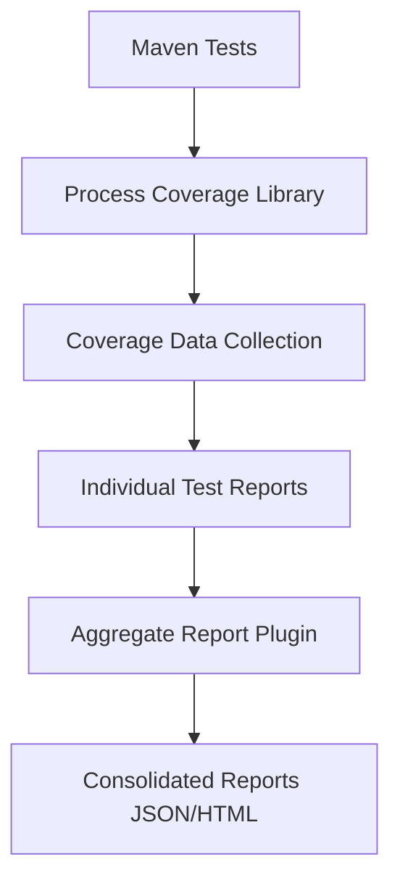

# Camunda Process Test Coverage Integration Guide

## Overview

This guide provides comprehensive instructions for integrating Camunda Process Test Coverage to generate detailed coverage reports for your BPMN processes. Process test coverage helps ensure that your BPMN processes are thoroughly tested by measuring which process paths, activities, and gateways are executed during test runs.

## Table of Contents

1. [Prerequisites](#prerequisites)
2. [Architecture Overview](#architecture-overview)
3. [Maven Configuration](#maven-configuration)
4. [Test Implementation](#test-implementation)
5. [Configuration](#configuration)
6. [Running Tests and Generating Reports](#running-tests-and-generating-reports)
7. [Report Analysis](#report-analysis)
8. [Troubleshooting](#troubleshooting)
9. [Best Practices](#best-practices)
10. [Common Issues](#common-issues)

## Prerequisites

### Software Requirements
- **Java**: JDK 11 or higher (Java 17 recommended)
- **Maven**: 3.6.0 or higher
- **Camunda Platform**: 7.x
- **Spring Boot**: 2.x or 3.x

### Project Structure
```
src/
├── main/
│   ├── java/
│   └── resources/
│       ├── *.bpmn (Process definitions)
│       └── application.yaml
└── test/
    └── java/
        └── coverage/ (Process coverage tests)
```

## Architecture Overview

The integration consists of three main components:

1. **Maven Dependency**: `camunda-process-test-coverage-spring-test-platform-7`
2. **Test Configuration**: Process coverage test listener and annotations
3. **Report Generation**: JSON and HTML coverage reports



## Maven Configuration

### 1. Add Version Property

Add the process test coverage version to your `pom.xml` properties:

```xml
<properties>
    <camunda-process-test-coverage.version>2.7.0</camunda-process-test-coverage.version>
    <camunda.version>7.22.0</camunda.version>
    <spring-boot.version>3.3.5</spring-boot.version>
</properties>
```

### 2. Add Dependencies

Add the following dependencies to your `pom.xml`:

```xml
<dependencies>
    <!-- Process Test Coverage -->
    <dependency>
        <groupId>org.camunda.community.process_test_coverage</groupId>
        <artifactId>camunda-process-test-coverage-spring-test-platform-7</artifactId>
        <version>${camunda-process-test-coverage.version}</version>
        <scope>test</scope>
    </dependency>
    
    <!-- Camunda Spring Boot Starter -->
    <dependency>
        <groupId>org.camunda.bpm.springboot</groupId>
        <artifactId>camunda-bpm-spring-boot-starter-test</artifactId>
        <version>${camunda.version}</version>
        <scope>test</scope>
    </dependency>
</dependencies>
```

### 3. Add Report Aggregator Plugin

Add the report aggregator plugin to your `pom.xml`:

```xml
<build>
    <plugins>
        <!-- Process Test Coverage Report Aggregator -->
        <plugin>
            <groupId>org.camunda.community.process_test_coverage</groupId>
            <artifactId>camunda-process-test-coverage-report-aggregator-maven-plugin</artifactId>
            <version>${camunda-process-test-coverage.version}</version>
            <executions>
                <execution>
                    <goals>
                        <goal>aggregate</goal>
                    </goals>
                </execution>
            </executions>
        </plugin>
    </plugins>
</build>
```

## Test Implementation

### 1. Create Process Coverage Test Class

Create a dedicated test class for process coverage:

```java
package org.your.package.coverage;

import org.camunda.bpm.engine.ProcessEngine;
import org.camunda.bpm.engine.RuntimeService;
import org.camunda.bpm.engine.TaskService;
import org.camunda.bpm.engine.runtime.ProcessInstance;
import org.camunda.bpm.engine.task.Task;
import org.camunda.bpm.engine.test.Deployment;
import org.camunda.community.process_test_coverage.spring_test.platform7.ProcessEngineCoverageTestExecutionListener;
import org.junit.jupiter.api.Test;
import org.junit.jupiter.api.extension.ExtendWith;
import org.springframework.beans.factory.annotation.Autowired;
import org.springframework.boot.test.context.SpringBootTest;
import org.springframework.test.context.TestExecutionListeners;
import org.springframework.test.context.junit.jupiter.SpringExtension;

import java.util.List;
import java.util.Map;

import static org.assertj.core.api.Assertions.assertThat;

@ExtendWith(SpringExtension.class)
@SpringBootTest
@TestExecutionListeners(
    value = ProcessEngineCoverageTestExecutionListener.class,
    mergeMode = TestExecutionListeners.MergeMode.MERGE_WITH_DEFAULTS
)
public class ProcessCoverageTest {

    @Autowired
    private ProcessEngine processEngine;

    @Autowired
    private RuntimeService runtimeService;

    @Autowired
    private TaskService taskService;

    @Test
    @Deployment(resources = "your-process.bpmn")
    public void testProcessCoverage_JsonPath_ShouldGenerateReport() {
        // Arrange
        Map<String, Object> variables = Map.of(
            "dataFormat", "json",
            "customerData", Map.of(
                "firstname", "John",
                "lastname", "Doe",
                "age", 30,
                "gender", "male",
                "isValid", true
            )
        );

        // Act
        ProcessInstance processInstance = runtimeService.startProcessInstanceByKey(
            "your-process-key", variables
        );

        // Complete user tasks if any
        List<Task> tasks = taskService.createTaskQuery()
            .processInstanceId(processInstance.getId())
            .list();

        for (Task task : tasks) {
            taskService.complete(task.getId());
        }

        // Assert
        assertThat(processInstance).isEnded();
    }

    @Test
    @Deployment(resources = "your-process.bpmn")
    public void testProcessCoverage_XmlPath_ShouldGenerateReport() {
        // Arrange
        Map<String, Object> variables = Map.of(
            "dataFormat", "xml",
            "customerData", Map.of(
                "firstname", "Jane",
                "lastname", "Smith",
                "age", 25,
                "gender", "female",
                "isValid", true
            )
        );

        // Act
        ProcessInstance processInstance = runtimeService.startProcessInstanceByKey(
            "your-process-key", variables
        );

        // Complete user tasks if any
        List<Task> tasks = taskService.createTaskQuery()
            .processInstanceId(processInstance.getId())
            .list();

        for (Task task : tasks) {
            taskService.complete(task.getId());
        }

        // Assert
        assertThat(processInstance).isEnded();
    }

    @Test
    @Deployment(resources = "your-process.bpmn")
    public void testProcessCoverage_FullCoverage_ShouldGenerateComprehensiveReport() {
        // Test multiple scenarios to achieve full coverage
        testProcessCoverage_JsonPath_ShouldGenerateReport();
        testProcessCoverage_XmlPath_ShouldGenerateReport();
        
        // Additional test scenarios for edge cases
        // ...
    }
}
```

### 2. Exclude Non-Coverage Tests

For integration tests that don't contribute to process coverage, add the exclusion annotation:

```java
import org.camunda.community.process_test_coverage.core.engine.ExcludeFromProcessCoverage;

@ExcludeFromProcessCoverage
@SpringBootTest
public class IntegrationTest {
    // Test methods that don't need process coverage
}
```

## Configuration

### 1. Application Test Configuration

Create or update your test configuration:

```yaml
# application-test.yaml
camunda:
  bpm:
    process-engine-name: test-engine
    database:
      schema-update: true
    deployment-resource-pattern: "classpath:**/*.bpmn"
    
logging:
  level:
    org.camunda.community.process_test_coverage: DEBUG
```

### 2. Coverage Report Configuration

The library automatically generates reports in the following locations:

#### Individual Test Reports
- `target/process-test-coverage/[test-class-name]/report.json`
- `target/process-test-coverage/[test-class-name]/report.html`

#### Aggregate Reports
- `target/process-test-coverage/all/report.json`
- `target/process-test-coverage/all/report.html`

## Running Tests and Generating Reports

### 1. Execute Tests

Run your tests to generate individual coverage reports:

```bash
# Clean and run tests
mvn clean test

# Run specific test class
mvn test -Dtest=ProcessCoverageTest

# Run tests with debug output
mvn test -Dtest=ProcessCoverageTest -X
```

### 2. Generate Aggregate Reports

After running tests, generate consolidated coverage reports:

```bash
# Generate aggregate report using the plugin
mvn org.camunda.community.process_test_coverage:camunda-process-test-coverage-report-aggregator-maven-plugin:2.7.0:aggregate

# Or if configured in pom.xml build section
mvn process-test-coverage:aggregate
```

### 3. Verify Report Generation

Check that reports have been generated:

```bash
# List all generated reports
find target/process-test-coverage -name "*.json" -o -name "*.html"

# Check aggregate report content
ls -la target/process-test-coverage/all/

# View report size and structure
wc -l target/process-test-coverage/all/report.json
```

### 4. Complete Build with Coverage

Run the complete build process with coverage generation:

```bash
# Full build with test coverage
mvn clean test org.camunda.community.process_test_coverage:camunda-process-test-coverage-report-aggregator-maven-plugin:2.7.0:aggregate

# Or use shorter command if plugin is configured
mvn clean test process-test-coverage:aggregate
```

## Report Analysis

### 1. HTML Report

Open the HTML report in your browser:

```bash
# Open aggregate HTML report
open target/process-test-coverage/all/report.html

# Or for specific test class
open target/process-test-coverage/ProcessCoverageTest/report.html
```

The HTML report provides:
- **Visual process diagrams** with coverage highlighting
- **Coverage statistics** by activity and gateway
- **Detailed execution paths** for each test method
- **Interactive navigation** between processes and tests

### 2. JSON Report Structure

The JSON report contains structured coverage data:

```json
{
  "processDefinitionKey": "your-process-key",
  "processDefinitionName": "Your Process Name",
  "coverage": {
    "totalElements": 15,
    "coveredElements": 12,
    "coveragePercentage": 80.0
  },
  "activities": [
    {
      "id": "startEvent",
      "name": "Start Event",
      "covered": true,
      "coverageCount": 3
    }
  ],
  "gateways": [
    {
      "id": "gateway1",
      "name": "Data Format Gateway",
      "covered": true,
      "coverageCount": 2
    }
  ],
  "testMethods": [
    {
      "className": "ProcessCoverageTest",
      "methodName": "testProcessCoverage_JsonPath_ShouldGenerateReport",
      "coverage": 60.0
    }
  ]
}
```

### 3. Coverage Metrics

Key metrics to analyze:
- **Overall Coverage**: Percentage of process elements covered
- **Activity Coverage**: Individual activity execution counts
- **Gateway Coverage**: Decision point testing completeness
- **Path Coverage**: Unique execution paths tested

## Troubleshooting

### Missing Coverage Reports

**Issue**: No reports generated after test execution

**Solutions**:
1. Verify test class annotations:
```java
@TestExecutionListeners(
    value = ProcessEngineCoverageTestExecutionListener.class,
    mergeMode = TestExecutionListeners.MergeMode.MERGE_WITH_DEFAULTS
)
```

2. Check process deployment:
```java
@Deployment(resources = "your-process.bpmn")
```

3. Ensure process execution in tests:
```java
ProcessInstance processInstance = runtimeService.startProcessInstanceByKey("process-key");
```

### Version Compatibility Issues

**Kotlin Compatibility Error**:
```
java.lang.NoSuchMethodError: kotlin/enums/EnumEntriesKt.enumEntries
```

**Solution**: Use version 2.7.0 which is stable:
```xml
<camunda-process-test-coverage.version>2.7.0</camunda-process-test-coverage.version>
```

### Low Coverage Percentages

**Issue**: Coverage reports show low percentages

**Solutions**:
1. **Test All Process Paths**: Ensure each gateway decision is tested
2. **Complete All Activities**: Test both success and error scenarios
3. **Multiple Test Methods**: Create separate tests for different paths
4. **Process Variable Testing**: Test different variable combinations

### Report Generation Failures

**Issue**: Aggregate report generation fails

**Solutions**:
1. Check Maven plugin configuration
2. Verify individual test reports exist
3. Run with debug output: `mvn -X process-test-coverage:aggregate`
4. Check target directory permissions

## Best Practices

### 1. Test Organization

- **Dedicated Coverage Tests**: Create separate test classes for process coverage
- **Comprehensive Scenarios**: Test all process paths and decision points
- **Edge Cases**: Include boundary conditions and error scenarios
- **Meaningful Test Names**: Use descriptive test method names

### 2. Process Design

- **Testable Processes**: Design processes with clear decision points
- **Modular Architecture**: Break complex processes into smaller, testable units
- **Clear Variables**: Use well-defined process variables
- **Documentation**: Document expected process paths

### 3. Coverage Strategy

- **Path Coverage**: Ensure all possible execution paths are tested
- **Gateway Testing**: Test all gateway conditions (true/false scenarios)
- **Activity Coverage**: Execute all activities at least once
- **Error Handling**: Test exception and error scenarios

### 4. Reporting

- **Regular Generation**: Generate reports after each test run
- **Trend Analysis**: Track coverage improvements over time
- **Threshold Setting**: Define minimum coverage requirements
- **Team Reviews**: Regular coverage report reviews

## Common Issues

### 1. Tests Not Captured

**Error**: Tests run but no coverage data collected

**Solution**:
- Verify `@TestExecutionListeners` annotation
- Check process deployment in test methods
- Ensure process instances are started and completed

### 2. Partial Coverage

**Error**: Some process elements not covered

**Solution**:
- Add test methods for uncovered paths
- Verify all gateway conditions are tested
- Check process variable scenarios

### 3. Report Access Issues

**Error**: Cannot open or access reports

**Solution**:
- Check file permissions in target directory
- Verify report generation completed successfully
- Use absolute paths when opening reports

## Validation

### 1. Verify Integration

After successful integration, verify:

- [ ] Tests execute without errors
- [ ] Individual coverage reports are generated
- [ ] Aggregate reports are generated successfully
- [ ] HTML reports display correctly in browser
- [ ] JSON reports contain expected structure
- [ ] Coverage percentages are reasonable

### 2. Coverage Quality

Expected outcomes:
- **High Coverage**: >80% for critical processes
- **Path Coverage**: All decision paths tested
- **Activity Coverage**: All activities executed
- **Gateway Coverage**: All conditions tested

## Conclusion

This integration provides comprehensive BPMN process test coverage reporting, enabling teams to:

- **Monitor Process Quality**: Track coverage of business processes
- **Identify Gaps**: Find untested process paths
- **Ensure Compliance**: Meet testing requirements for critical processes
- **Improve Quality**: Maintain high standards for process implementations
- **Generate Documentation**: Create visual coverage reports for stakeholders

The generated reports provide both technical details for developers and visual representations for business stakeholders, making process testing transparent and measurable.

For additional support, refer to:
- [Camunda Process Test Coverage Documentation](https://github.com/camunda-community-hub/camunda-process-test-coverage)
- [Camunda Platform Documentation](https://docs.camunda.org/) 